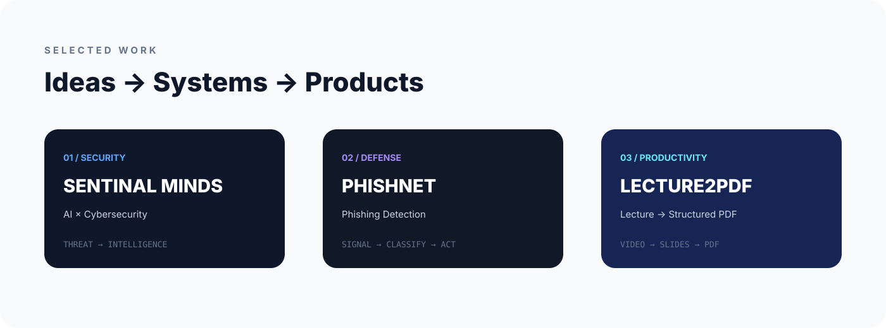

<div align="center">


<br/>


<br/><br/>

<a href="https://github.com/RajGahoi">

</a>
<a href="https://leetcode.com/u/raj_gahoi/">

</a>
<a href="https://www.linkedin.com/">

</a>

</div>

---

<div align="center">

## ✦ I BUILD THINGS I WISH EXISTED.

**Computer Science undergraduate · Problem solver · Builder**

</div>

### `01 / ABOUT`

I'm **Raj Gahoi**, a CSE undergraduate interested in software engineering, problem solving, full-stack development and intelligent systems.

I like taking an idea through the complete engineering loop:

`PROBLEM → RESEARCH → ARCHITECTURE → CODE → DEBUG → SHIP → IMPROVE`

> **I don't just learn technology. I build with it.**

### CURRENTLY IN THE LAB

| 🧠 DSA | ◈ WEB | ⚙ BACKEND | ✦ AI |
|---|---|---|---|
| Algorithms | React | APIs | ML |
| Patterns | JavaScript | PostgreSQL | Automation |
| CP | UI | Systems | Intelligence |

---

<div align="center">



</div>

## `02 / SENTINAL MINDS`

### AI × CYBERSECURITY

A security-focused platform built around **threat analysis, investigation and actionable intelligence**.

`THREAT → EVIDENCE → ANALYSIS → INTELLIGENCE → ACTION`

`AI` · `Cybersecurity` · `Automation`

[**SOURCE →**](https://github.com/RajGahoi)

---

## `03 / PHISHNET SENTINALS`

### INTELLIGENT PHISHING DEFENSE

A cybersecurity project focused on identifying and analyzing phishing threats.

`INPUT → INSPECT → SIGNAL → CLASSIFY → RESPOND`

`Security` · `Web` · `Threat Detection`

[**SOURCE →**](https://github.com/RajGahoi)

---

## `04 / LECTURE2PDF AI`

### VIDEO → STRUCTURED NOTES

A Chrome extension that turns lecture videos into organized PDF notes by detecting meaningful lecture slides.

```text
VIDEO
  ↓
SLIDE DETECTION
  ↓
PROCESSING
  ↓
PDF GENERATION
  ↓
NOTES
```

`JavaScript` · `Chrome Extension` · `AI` · `PDF`

[**SOURCE →**](https://github.com/RajGahoi)

---

<div align="center">

## `05 / PROBLEM SOLVING ROOM`

### I don't collect solutions. I collect patterns.


<br/><br/>

`UNDERSTAND → PATTERN → APPROACH → OPTIMIZE → CODE → TEST`

</div>

---

<div align="center">

## `06 / TOOLBOX`


</div>

---

<div align="center">

## `07 / GITHUB TELEMETRY`


<br/><br/>


</div>

---

<div align="center">

## `08 / CONTRIBUTION TRAIL`


</div>

---


## `08.5 / AUTOMATED ARCADE WORKFLOW`

```text
GitHub Contributions
        ↓
   GitHub Actions
        ↓
     PAC-MAN 🎮
        ↓
 Animated SVG
        ↓
   output branch
        ↓
     README
```

The Pac-Man graph updates automatically and can also be started manually from the **Actions** tab.

## `09 / THE ROAD AHEAD`

```text
DSA
 ↓
PROBLEM SOLVING
 ↓
FULL STACK
 ↓
BACKEND
 ↓
SYSTEM DESIGN
 ↓
AI / ML
 ↓
SOFTWARE ENGINEERING
```

---

<div align="center">

## `10 / ENGINEERING PHILOSOPHY`

**Build before you overthink.**

**Understand before you copy.**

**Debug before you blame the code.**

**Ship before you call it finished.**

<br/>

`CURIOUS` · `CONSISTENT` · `HUNGRY TO BUILD`

<br/><br/>

<a href="https://github.com/RajGahoi">

</a>
<a href="https://leetcode.com/u/raj_gahoi/">

</a>
<a href="https://www.linkedin.com/">

</a>

<br/><br/>

### `BUILD / SOLVE / SHIP / REPEAT`

</div>
