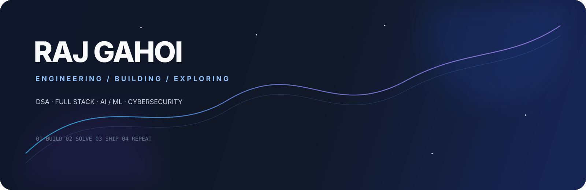

 

  

01 / About

I'm Raj Gahoi, a Computer Science undergraduate interested in software engineering, problem solving, full-stack development and intelligent systems.

I like taking an idea through the complete engineering loop:

Problem → Research → Architecture → Code → Debug → Ship → Improve

I don't just learn technology. I build with it.

Current focus

🧠 Data Structures & Algorithms

🌐 React + Full Stack Development

⚙️ Backend Engineering & REST APIs

🗄️ PostgreSQL & Redis

🤖 AI / ML

🏆 Hackathons & real-world products

02 / Tech Stack

03 / Selected Work

🧠 SENTINAL MINDS

AI × Cybersecurity

A security-focused intelligent system built around threat analysis, investigation and actionable intelligence.

AI · Cybersecurity · Automation

View GitHub →

🎣 PHISHNET SENTINALS

A cybersecurity project focused on identifying and analyzing phishing threats through intelligent detection.

Flow

Input → Inspection → Threat Signals → Classification → Response

Security · Web · Threat Detection

View GitHub →

📚 LECTURE2PDF AI

A Chrome extension that transforms lecture videos into structured PDF notes by detecting important lecture slides.

Flow

Video → Slide Detection → Processing → PDF

JavaScript · Chrome Extension · AI · PDF Generation

View GitHub →

04 / Problem Solving

PROBLEM → PATTERN → APPROACH → OPTIMIZE → CODE → TEST

Every difficult problem adds another pattern to the mental toolkit.

05 / GitHub Telemetry

06 / Contribution Journey

07 / Engineering Loop

THINK → BUILD → BREAK → DEBUG → LEARN → SHIP

08 / The Road Ahead

Area

Direction

🧠 DSA

Stronger patterns + competitive programming

🌐 Full Stack

Production-ready applications

⚙️ Backend

APIs, databases, architecture

🏗️ Systems

Engineering fundamentals + system design

🤖 AI/ML

Practical intelligent applications

🌍 Open Source

Meaningful contributions

09 / Philosophy

Don't chase every technology.

Understand the fundamentals.

Build things that matter.

Let the code speak.

10 / Connect

BUILD • SOLVE • SHIP • REPEAT

